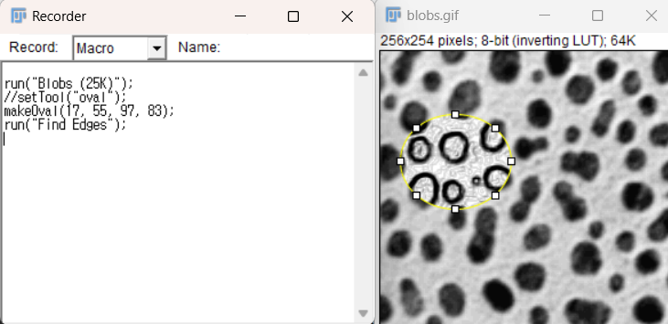
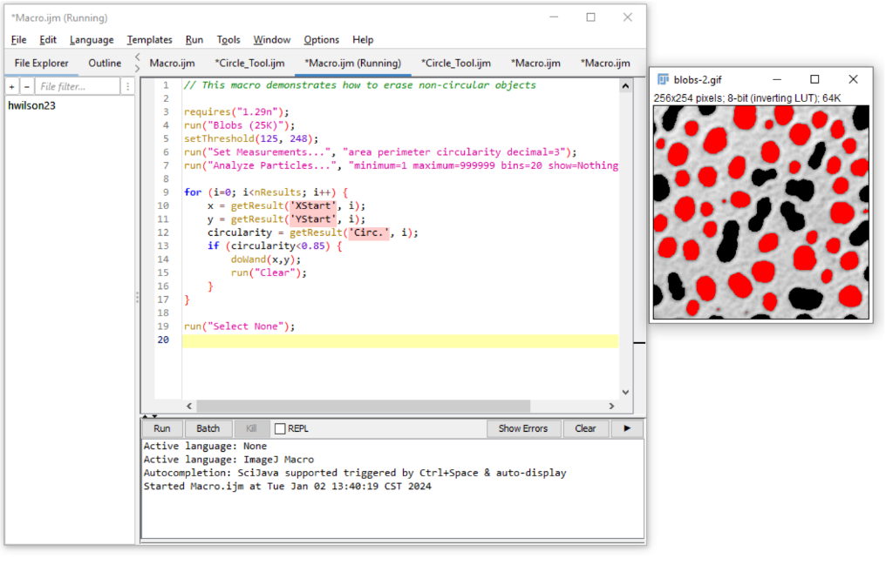
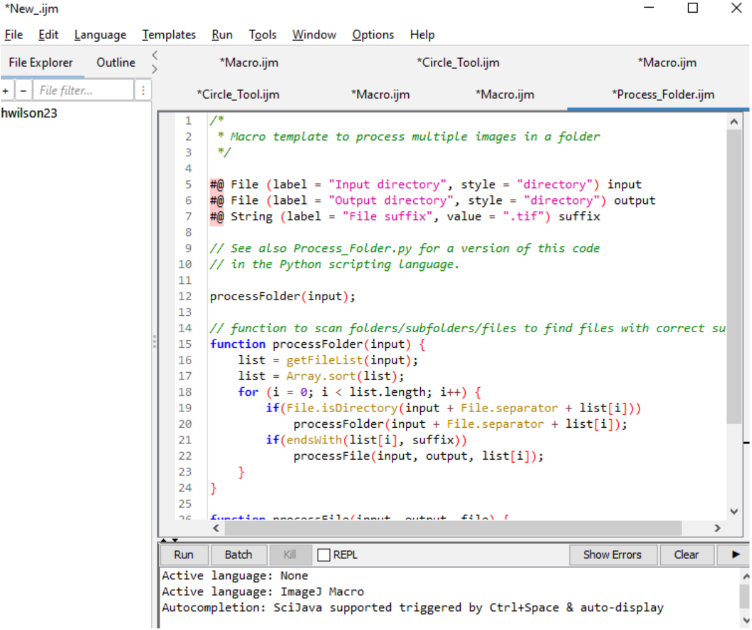

# Scripting

Scripts can be generated in a variety of ways, including the **Macro Recorder**.  
For functions included in the ImageJ Macro language, please see:  
[https://imagej.net/ij/developer/macro/functions.html](https://imagej.net/ij/developer/macro/functions.html)

More general scripting info:  
[https://imagej.net/scripting/](https://imagej.net/scripting/)

---

## Macro Recorder

[https://imagej.net/scripting/macro](https://imagej.net/scripting/macro)

1. Use **Plugins > Macros > Record** to start recording simple steps and begin generating code.
Note that when clicking around in FIJI, you may generate unnecessary or overly specific commands, which means macros generated through the recorder will typically require some editing before use on other images.

For example:
- Open **Blobs** via **File > Open Samples > Blobs**
- Draw a circle or rectangle using the tools
- Run **Process > Find Edges**

More example scripts:  
[https://imagej.net/ij/macros/](https://imagej.net/ij/macros/)

### Why does the recorder not show a response for all plugins?
Not every developer has made the plugins compatible with the macro recorder, which
may cause various bugs or a lack of response from the recorder. In some cases, a script may be
used to generate similar functionality, but other times this may just be a limitation of the plugin.
The [Image.sc forum](https://forum.image.sc) would be a good resource for help if you are able to provide enough
information about the error and the analysis goals.

---

## Batch Processing

1. Batch processing can be done directly via the macro script editor using a provided template:
   [https://imagej.net/scripting/batch#option-2---script-template](https://imagej.net/scripting/batch#option-2---script-template)
2. Open the script editor: **Plugins > New > Macro**
3. The template can be accessed in the script editor by using  **Templates > ImageJ 1.x > Batch > Process Folder (ImageJ Macro)**

 This template contains an existing loop to process each file in the folder
using the “processFolder” and “processFile” functions. It requires the user
to specify the input and output directory as well as the file information.
1. When you are inserting the macro recorder script into the bottom
function, remember to open and save the file using the **`open()`** and **`saveAs()`** functions.

 - The benefits of this is that the files can be more specifically iterated if
needed with minor adjustments to the code. For example, try changing `i++` to `i = i + 2` to process every other file.

