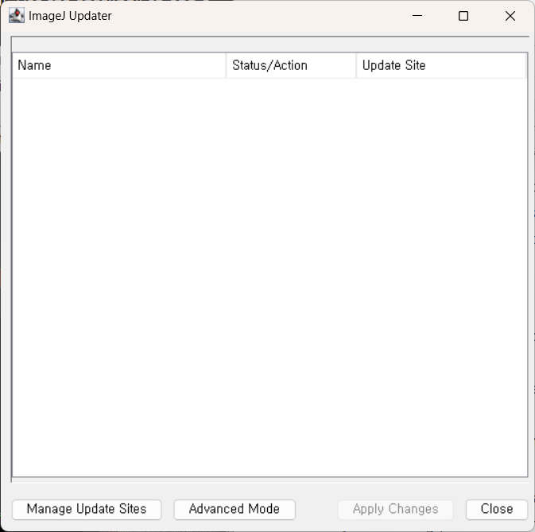

# Installing ImageJ/FIJI

## Download FIJI Package

1. Download FIJI package from the software site
FIJI has pre-installed plugins and is recommended for this lab.
Download it at [https://imagej.net/software/fiji/downloads](https://imagej.net/software/fiji/downloads).
Look for the zip folder and extract the contents to the desired location on your computer. Keeping it in "Program Files" is generally not recommended to avoid access/security issues.

## Installation
We’re going to run the new Jaunch launcher, because it runs faster and allows running without security popups. If it doesn't show up within two minutes of running, then run the backup launcher.

### Windows

- Right-click on `fiji-win64.zip` and choose **Extract All...** to `Downloads\` (avoid placing it in `Program Files`).
- Open the `Fiji64.app` folder.
- **New launcher**: Run  `Fiji-windows-x64.exe` in that folder.
- Running for the first time may take about 60 seconds.
- **Backup launcher**: Run `ImageJ-win64.exe` in that folder.

### Linux

- Unzip `fiji-linux64.zip`:
  ```bash
  unzip fiji-linux64.zip
  cd Fiji.app/
  ```
- **New launcher**:
  ```bash
  ./fiji-linux-x64
  ```
- **Backup launcher**:
  ```bash
  ./ImageJ-linux64
  ```

### macOS

- Double-click `fiji-macos.zip` to extract.
- (Optional: copy `Fiji.app` to Desktop.)
- Right-click on  `Fiji.app`, choose **Show Package Contents**.
- You will see a folder containing another  `Fiji` icon inside it.  
  Double-click the **second** `Fiji` icon to launch.
- If it doesn’t work, see backup instructions below.

#### Backup Instructions for macOS

- Double-click `fiji-macos.zip` to extract.
- (Optional: copy `Fiji.app` to Desktop.)
- Try opening  `Fiji.app`.
  This will likely be rejected by macOS for security reasons.
- Open **Apple Menu > System Settings**.
- Search for **Gatekeeper**.
- You should see the text  
  "Fiji.app was blocked..."_ → click **Open Anyway**.
- Enter your password or use your fingerprint if prompted.
- Click **Open**.  
  After this, you should be able to open `Fiji.app` directly.


### A Side Note on Updating

When using FIJI, it is recommended to use **Help > Update** rather than **Help > Update ImageJ**.  
Update ImageJ will specifically update only the base ImageJ package within FIJI, not the associated plugins.  
This makes it more likely that you will run into version issues and other update problems.  
Generally, updating when prompted upon opening FIJI will also help prevent issues.


## Install Plugins with Update Sites

1. After running **Help > Update**, there will be an option to **Manage Update Sites**.  
   This provides access to common plugins that are compatible with FIJI. Use the checkbox to add a plugin, then click **Apply and Close**.



2. Click **Apply Changes**, then restart FIJI.
3. You should now be able to search for and run the plugin.

## Downloading a Practice Dataset

The complete list of files may be downloaded at the following links:

Google Drive:
[https://drive.google.com/drive/folders/1lgn-S5fZZZX0mwou23S_f6d3dG2Di64g?usp=drive_link](https://drive.google.com/drive/folders/1lgn-S5fZZZX0mwou23S_f6d3dG2Di64g?usp=drive_link)

Github:
[https://github.com/brp-optics/FIJI_Lab_Tutoriall](https://github.com/brp-optics/FIJI_Lab_Tutorial)
