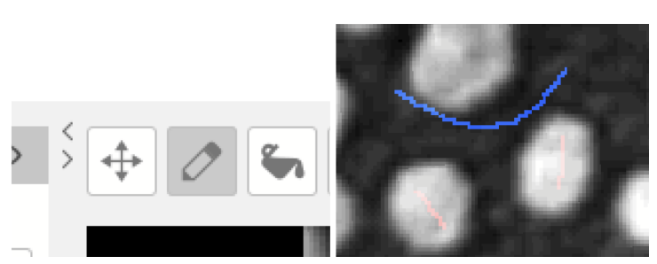
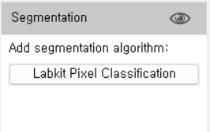

# Labkit Segmentation

[https://imagej.net/plugins/labkit/](https://imagej.net/plugins/labkit/)

Arzt, M., Deschamps, J., Schmied, C., Pietzsch, T., Schmidt, D., Tomancak, P., … Jug, F.  
(2022). LABKIT: Labeling and Segmentation Toolkit for Big Image Data. *Frontiers in Computer Science, 4*. doi:[10.3389/fcomp.2022.777728](https://doi.org/10.3389/fcomp.2022.777728)

Labkit uses a pixel classifier to create image segmentation. This requires labeling the foreground and background of an image.

1. Open Blobs with **File > Open Samples > Blobs**. Then open Labkit using **Plugins > Labkit > Open Current Image with Labkit**.

2. The Labkit window will automatically load the selected image. Next, use the pencil tool to draw a line on a few pixels that are background (blue) and foreground (red).

3. Now, we can run the pixel classifier to segment the image. Use the “play” button for the specific classifier within the segmentation part of the window.

4. This should produce a classified image similar to the one shown below with blue as the background and red as the object of interest.

5. The classifier can be saved and applied to multiple images. Click on the settings button on the classifier to save either the classifier or the image results.

