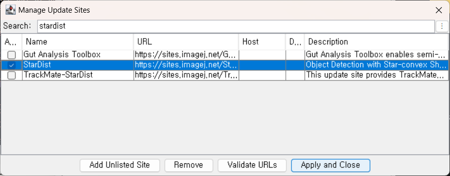
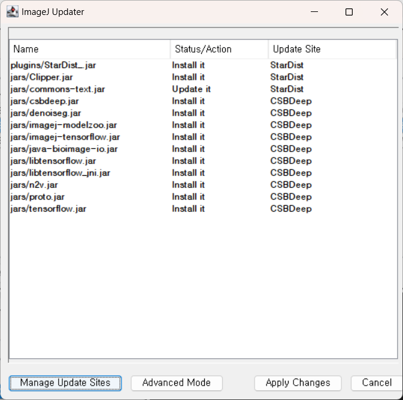
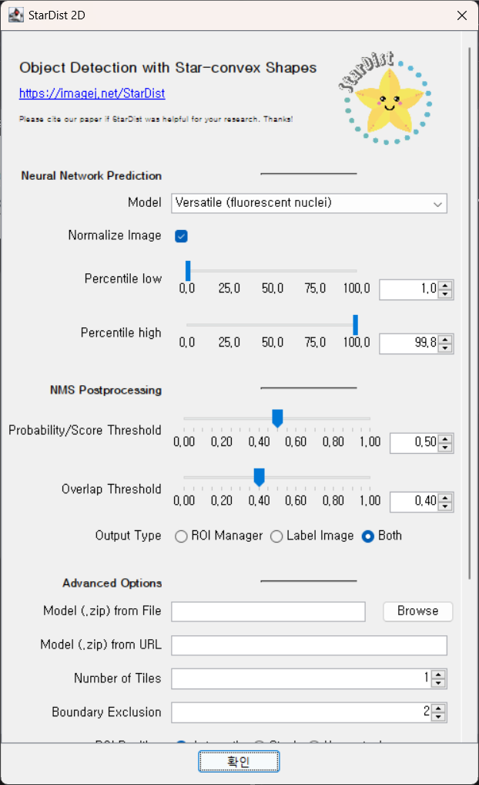
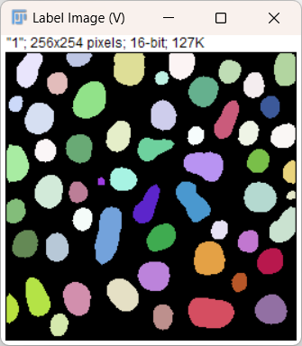

# StarDist – Basic Example

Source: [https://github.com/stardist/stardist](https://github.com/stardist/stardist)  
Additional info (FAQs): [https://stardist.net/index.html](https://stardist.net/index.html)  
ImageJ documentation: [https://imagej.net/plugins/stardist](https://imagej.net/plugins/stardist)

Uwe Schmidt, Martin Weigert, Coleman Broaddus, and Gene Myers.  
*Cell Detection with Star-convex Polygons*.  
International Conference on Medical Image Computing and Computer-Assisted Intervention (MICCAI), Granada, Spain, September 2018.

Martin Weigert, Uwe Schmidt, Robert Haase, Ko Sugawara, and Gene Myers.  
*Star-convex Polyhedra for 3D Object Detection and Segmentation in Microscopy*.  
The IEEE Winter Conference on Applications of Computer Vision (WACV), Snowmass Village, Colorado, March 2020.

1. StarDist is a deep learning tool to segment [star-convex](https://en.wikipedia.org/wiki/Star_domain) shapes (usually blobs, such as cells or nuclei). It can be installed as a FIJI plugin. Add StarDist through **Update > Manage Update Sites**. Also add the **CSB Deep** plugin ([https://imagej.net/plugins/csbdeep](https://imagej.net/plugins/csbdeep)):

2. As of May 2025, libraries which use TensorFlow 1.15 have a conflict with the built-in version of `protobuf-java` version 4. To avoid this we also add the **TensorFlow** plugin, which includes `protobuf-java` version 3.28, and remove (delete) `protobuf-java-4.xx.yy.jar` from the `Fiji.app/jars` directory before restarting Fiji.
  - You can also download the latest version of protobuf-java-3 from Mvn Central and place it in `Fiji.app/jars`. At the time of writing, the latest version is 3.25.7: [download page](https://mvnrepository.com/artifact/com.google.protobuf/protobuf-java/3.25.7), [direct download link](https://repo1.maven.org/maven2/com/google/protobuf/protobuf-java/3.25.7/protobuf-java-3.25.7.jar).

3. Open the blobs image as a simple test case: **File > Open Samples > Blobs**.
4. Run **Plugins > BIOP > StarDist > StarDist2D**. If we run with the default parameters, shown below, with the “Versatile (fluorescent nuclei)” model we get the following result.

    a. The other options for the Neural Network Prediction allow us to adjust the percentile for image normalization.  
    b. NMS (non-maximum suppression) Postprocessing parameters operate as follows[^1]:  
        - **Probability/Score Threshold** – higher values lead to fewer segmented objects, but will likely avoid false positives.  
        - **Overlap Threshold** – higher values allow segmented objects to overlap substantially.

    c. Advanced options can be used to apply a user-trained model.

5. We can also test this using the image `trackmate_example_data.tif` for a timeseries example. Again run with default settings.

[^1]: From: [https://imagej.net/plugins/stardist](https://imagej.net/plugins/stardist)

